# Amazon Shop Clone: An E-commerce store using Mongo Express Node React Redux Stack

# 🌟 About the Project

A virtual ecommerce website using React, Node js, Express js, and Mongoose.

# 📔 Table of Contents

    1. Screenshots
    2. Tech Stack
    3. Features
    3. Database

##  📷 Screenshots

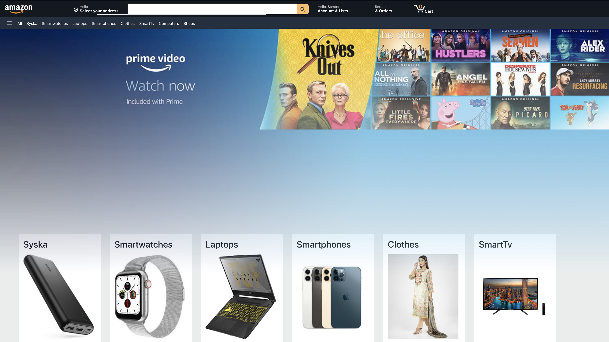

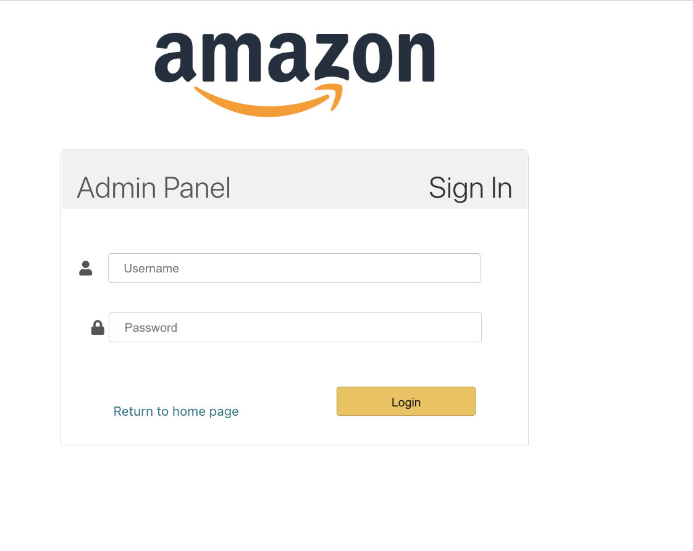

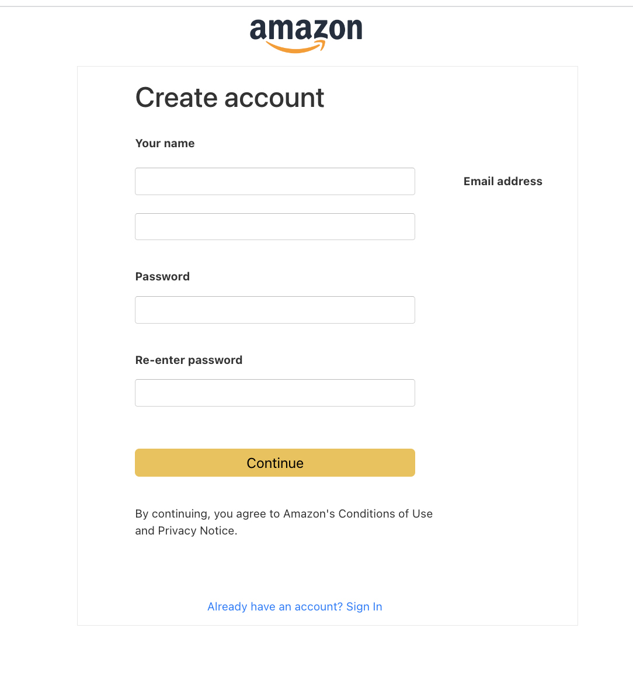

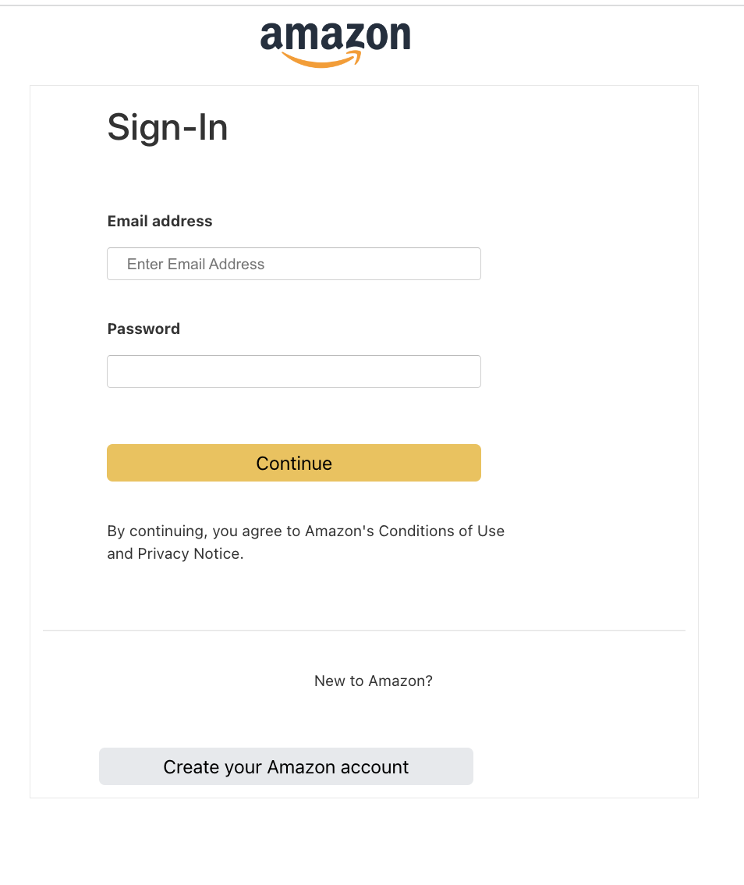

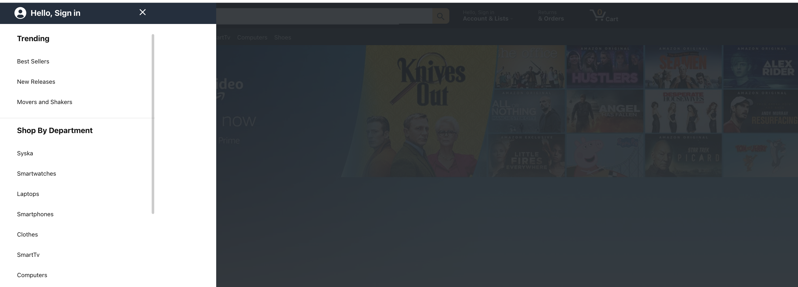

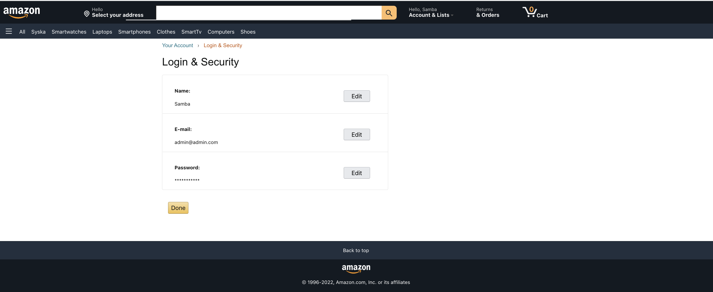

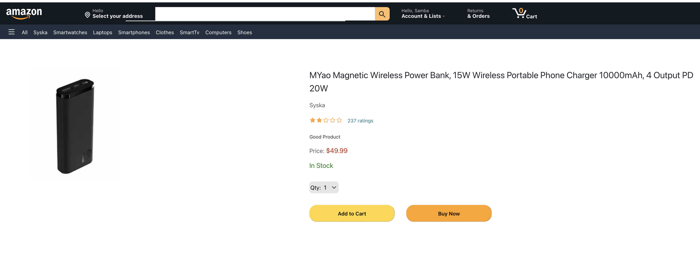

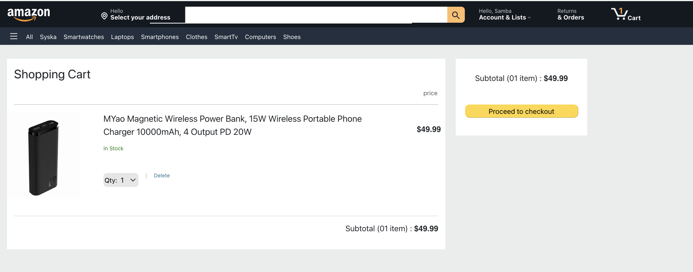

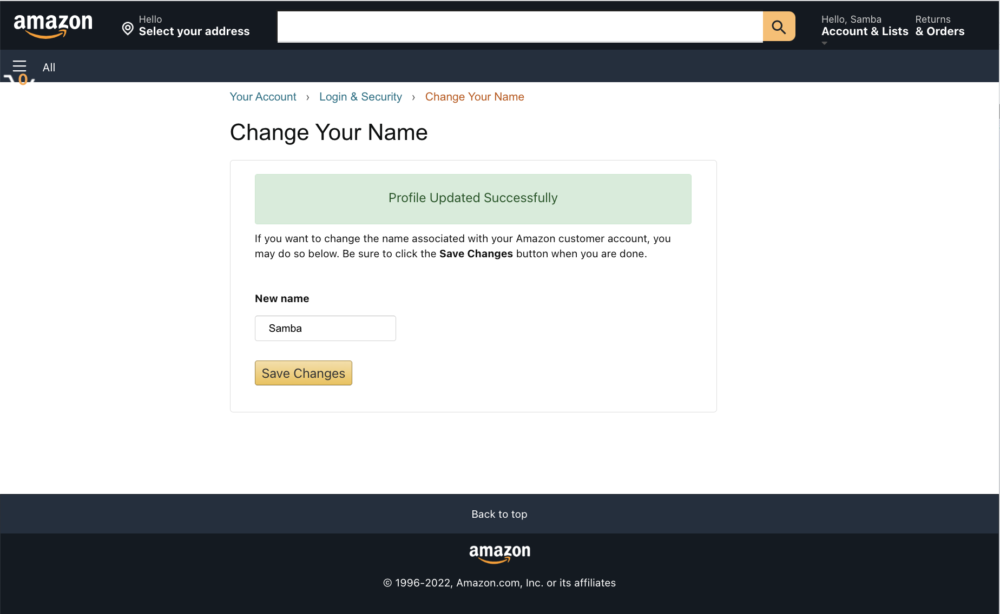

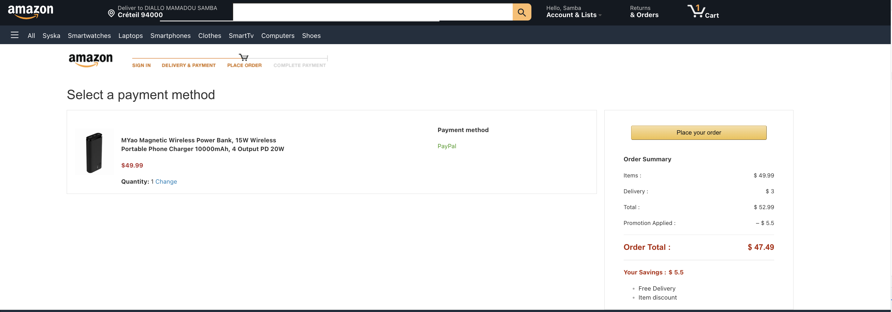

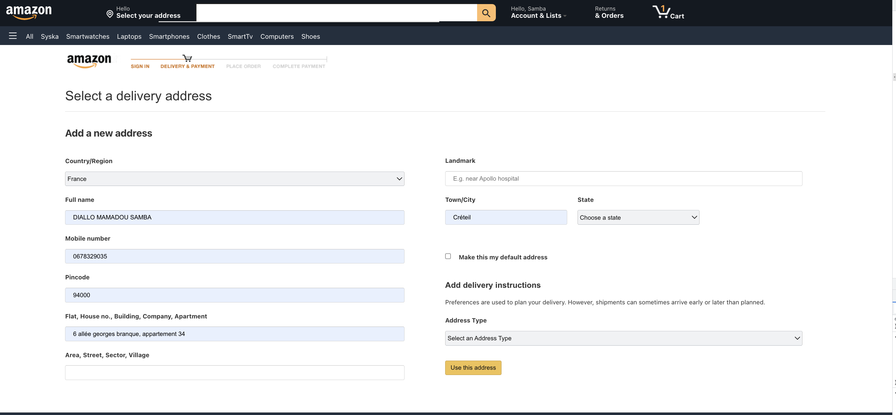

## 👾 Tech Stack

The application is built with:

React version 17.0.2
Node.js version 12.16.3
Mongoose version 6.1.8
Firebase version 9.6.6
Express version 4.17.2
Bootstrap version 5.2.0

### Technology
    The application displays an online store that contains products.

    Users can do the following:

    Create an account, login
    Browse available products added by the admin
    Add products to the shopping cart
    Buy products, in order to proceed forward, a user must be logged in
    Display the shopping cart
    The profile contains all the orders a user has made
    Admins can do the following:

    Can manage orders, users, products.

### Database
    All the models can be found in the models directory created using mongoose.

# 🧰 Getting Started

This project uses Yarn as package manager

 npm install --global yarn

# ⚙️ Installation

  yarn install my-project
  cd my-project
# 🧪 Running Tests

  yarn test test
